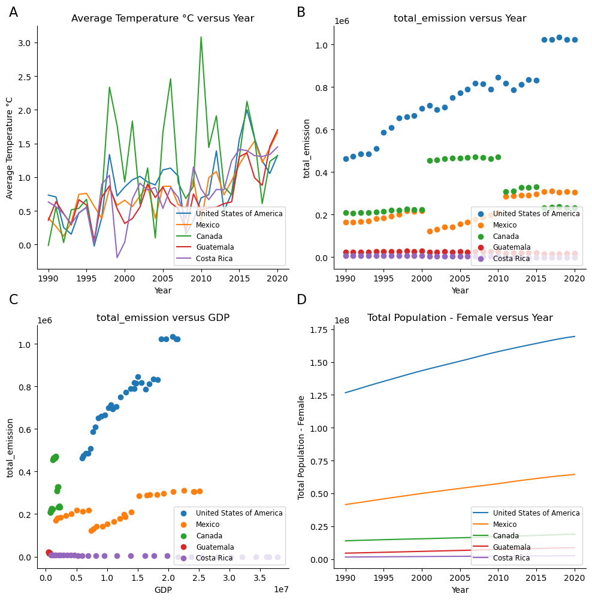

## **Overview**

For a more complete project overview, installation instructions, and usage
example please see the README at the top level of this repository.

## **Report**

This report is for assignment 9, whose target audience is Uncle John attending
Thanksgiving. The goal is to show him data about changing temperatures in 
North America and how it relates to our environment. The five countires used
in the analysis are: United States, Mexico, Canada, Guatemala, and Costa Rica.

## **Results**

**Figure 1:**

A. Average temperature in Celsius in the five North American countries over
time, from 1990 to 2020.
B. Total emissions from each country over time, from 1990 to 2020.
C. Total emissions from each country versus GDP of each country.
D. Total female population (roughly half of a country's total population)
in each country over time, from 1990 to 2020.

## **Interpretation:**

In all five North American countries, average temperature has increased over
the 30 years of data reported here (Figure 1A). Although the average temperature
appears to vary more in some country (like Canada), than others, the trend is
clear and appears to account for a 1-1.5 degree Celsius increase in average.
Over the same time period, total emissions have increased for some but not all
of these countries (Figure 1B). The United States has the clearest increase in
emissions as well as the absolute highest level of emissions at every year
reported here. Canada and Mexico have shown inconsisent but slight increases in emissions over the time period, while Guatemala and Costa Rica continue to
produce a similarly low level of emissions. Looking at the relationship between
emissions and GDP may help to explain the differences by country (Figure 1C).
Both the United States and Mexico show a positive correlation between increasing
GDP and increasing emissions. Canada appears to maintain a similar GDP with
slightly increasing emissions, and Guatemala is hard to evalute on this plot
as it's values for both are much smaller than the other countries. Costa Rica
shows a surprising trend, as GDP increases above even the maximum observed for
the United States while emissions remain low. Another factor that distinguishes
these countries from each other is populations differences, represented here
by showing just the female population (Figure 1D). All countries show an
increase in population over the time period, but the United States and Mexico
by far have both the largest increases and the largest populations.

This figure shows that although these North American countries do not contribute
equally to total emissions and do not contribute the same level of population
burden to the planet, they are all experiencing the same increase in average
temperature. In general, countries with higher GDP and a larger population
are contributing more to the emissions that are contributing to raising global
temperatures for all countries. What one country does affects all countries,
and it is especially important that large countries like the United States,
which are contributing the most to this problem, take action to reduce emissions.

## **Improvements:**

If the report were to be improve for Uncle John next year, I would expand it to
look beyond just North America. It may be helpful to show an example of a country
like the United States but that is not the United States, as this may approach
may meet less emotional resistance. Also, instead of focusing on emissions data,
I think it would be interesting to focus on emissions from different types of
things, such as driving cars versus feeding a large population. I am not sure this
data is available, but it could be useful to find an example that Uncle John feels
more connection to and potentially a behavior he could change.

### Methods

The results were generated two different ways:

1. Using the bash script run_make_report.sh
2. Reproducibly, using the snakefile under workflow/snakefile
